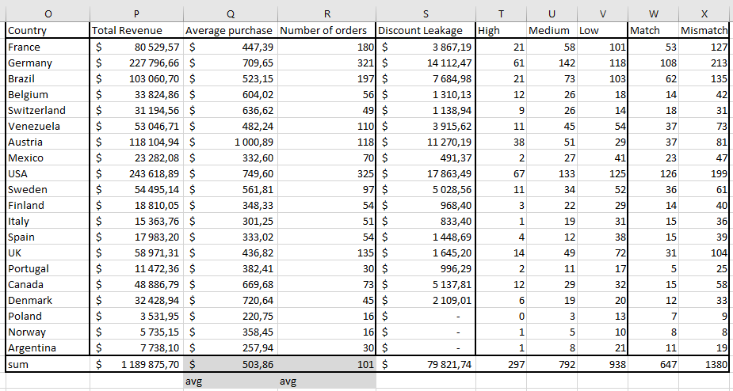

## Excel Northwind Dataset Analysis Project

Dataset: Northwind dataset (3308 records)

Dataset Source:
https://www.kaggle.com/datasets/ayoubcherguelaine/company-documents-dataset

##  Project Overview
The goal of this project was to transform raw relational data into a financial auditing and sales performance tool. By leveraging advanced Excel functions, I built a system to reconcile pricing, identify revenue leakages, and segment customers. This project demonstrates how Excel can be used not just for reporting, but as a control layer to ensure price consistency and margin protection across international markets.

Key Objectives:

Data Integration: Consolidating multi-table data using XLOOKUP and INDEX/MATCH to create a unified analysis master-sheet.

Financial Audit: Implementing a Price Reconciliation layer to detect discrepancies between transaction prices and the master price list.

Performance Metrics: Analyzing "Discount Leakage" and "Delivery Performance" to identify operational bottlenecks.

Strategic Segmentation: Categorizing global revenue streams into High/Medium/Low tiers to prioritize key market regions.

### Tools Used
- Microsoft Excel
- XLOOKUP
- SUMIFS / COUNTIFS / AVERAGEIF
- IF
- Conditional Formatting
- Pivot table

---

## 1. Data Cleaning

- Checked the dataset for duplicate records (none found)
- Removed rows with missing values
- Standardized numeric format in the following columns: unit_price, discount, freight
- Ensured that unit_price values were positive

These steps ensured the dataset was consistent before starting the analysis.

---

## 2. Data Transformation

Data from multiple tables were combined using **XLOOKUP** and **INDEX/MATCH**.

- Matched **country** and **employee_id** columns from the Orders table
- Calculated the following metrics:
  - Purchase Amount
  - Discount Amount
  - Revenue
- Added a column indicating whether an order included a discount using the **IF** function.
- Added a column indicating type of revenue
- Added a column for Price Reconciliation
Conditional formatting was used to highlight orders with mismatch.

Also added a column delivery to show if delivery performance was fast or slow

**Created Data Validation Sheet** 
- Copied unit_id and product_price
- Created pivot table with max price on each product

This table is a basic price list for products

---

## 3. Data Analysis

A summary table was created to analyze sales performance by country.

Using **SUMIF** , **AVERAGEIF**, **COUNTIFS**,**IF** the following metrics were calculated:

- Total Revenue
- Average Purchase Value
- Number of Orders
- Discount Leakages

Revenue Segmentation Analysis
- High when revenue >1000
- Medium when >300
- Low <300

Table showing volume of orders with price match/mismatch

This allowed comparison of sales performance across different countries.

---

## Conclusion

By implementing a Price Reconciliation layer, I've shown how Excel can be used as an audit tool to identify financial discrepancies. The analysis of Discount Leakage and Revenue Categorization provides actionable insights for sales teams to optimize pricing strategies and minimize margin erosion.

